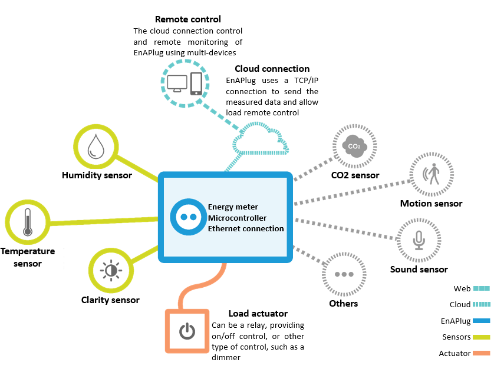
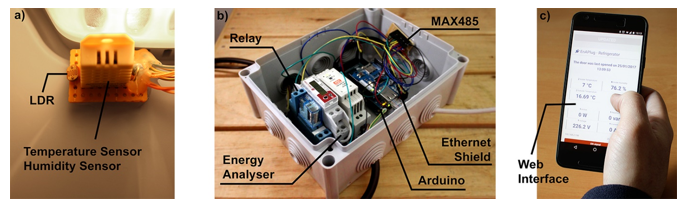

# EnAPlug
Environmental Awareness Smart Plug (EnAPlug), it is a smart plug capable of reading the context of its controllable resource. The application of external sensors provide the ability to read the context. This contributes with data for energy management systems that can then optimize the resources of the building.

The provided version uses an Arduino Mega to make it easy to build. However, a new version has been tested in our labs. You can read more in:
* Luis Gomes, Filipe Sousa, Zita Vale “EnAPlug – An Environmental Awareness Plug to Test Energy Management Solutions for Households” in: Oliveira E., Gama J., Vale Z., Lopes Cardoso H. (eds) Progress in Artificial Intelligence. EPIA 2017. Lecture Notes in Computer Science, vol 10423. Springer, Cham. Doi: [10.1007/978-3-319-65340-2_21](www.doi.org/10.1007/978-3-319-65340-2_21);
* Luis Gomes, Filipe Sousa, Zita Vale “An Agent-Based IoT System for Intelligent Energy Monitoring in Buildings” in Proceedings of 2018 IEEE 87th Vehicular Technology Conference (VTC Spring), Porto, Portugal, 2018, pp. 1-5. Doi: [10.1109/VTCSpring.2018.8417868](www.doi.org/10.1109/VTCSpring.2018.8417868);
* Luis Gomes, Filipe Sousa, Zita Vale “An Intelligent Smart Plug with Shared Knowledge Capabilities” in Sensors, vol. 18, pp. 3961, 2018. Doi: [10.3390/s18113961](www.doi.org/10.3390/s18113961);
* Luis Gomes, Filipe Sousa, Tiago Pinto, Zita Vale “A Residential House Comparative Case Study Using Market Available Smart Plugs and EnAPlugs with Shared Knowledge” in Energies, vol. 12, pp. 1647. Doi: [10.3390/en12091647](www.doi.org/10.3390/en12091647).

## Concept
Currently, only wired sensors are available

## Example
This is the use of an EnAPlug in a refrigerator with four sensors: inside temperature sensor, inside humidity sensor, inside light sensor (to detect the opening of the door), and an outside temperature sensor. The file in this repository is the one working in the showed refrigerator. The web interface is not part of this repository.

